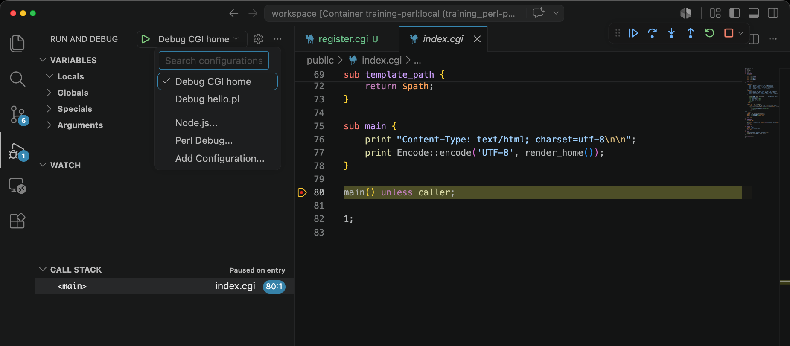

# training_perl_cgi

DockerコンテナのPerl練習用の環境です。
デバッガーを使ってステップ実行して入門しましょう。
Apache の CGI 方式で動くホーム画面も用意しています。
フロントのHTMLは `public/index.html`、CGIスクリプトは `public/index.cgi` です。

## 使い方

```sh
make build
make up
```

ブラウザで開く:

```txt
http://localhost:3000
```

シェルに入る場合:

```sh
make shell
```

コンテナを起動したままにする場合:

```sh
make up
docker compose exec perl bash
```

テスト:

```sh
make test
```

## VSCode でデバッグする

VSCode に Dev Containers 拡張が入っている状態で、このフォルダを開いてから `Dev Containers: Reopen in Container` を実行してください。

コンテナ内の VSCode には Perl 拡張 `richterger.perl` が入り、Docker イメージ側にはデバッグアダプタ兼 language server の `Perl::LanguageServer` が入ります。

デバッグは VSCode の Run and Debug から以下を選べます。

- `Debug CGI home`
- `Debug hello.pl`

CGIホーム画面を追うなら `Debug CGI home`、最初のステップ実行なら `Debug hello.pl` でブレークポイントを置いて実行できます。

CPAN モジュールを追加したい場合は `cpanfile` に書いてから、必要に応じて Dockerfile や起動後のコンテナでインストールしてください。

詳しい手順は [GETTING_STARTED.md](GETTING_STARTED.md) を見てください。

補足事項<br>
Perl拡張機能のデバッガーは、Xdebugのように画面アクセスのタイミングで使えない。Perl の VS Code デバッガは、Xdebug のように「ブラウザで画面アクセス → CGI実行 → 自動でVS Codeに接続 → ブレークポイントで停止」という使い方は、標準状態ではやりにくい。Xdebug は PHP 側に組み込まれる拡張なので可能。実際にボタンを押した瞬間に VS Code デバッガが自動起動して止まる、という動きは今の Perl 拡張ではそのままはできません。Apache が CGI を別プロセスで起動するので、VS Code 側がそのプロセスに attach できないためです。

画面を選択してデバッガースタートを押している様子


Enjoy!
